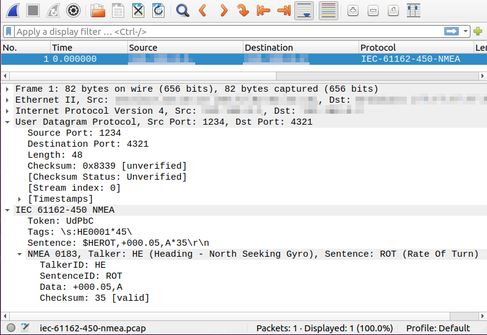
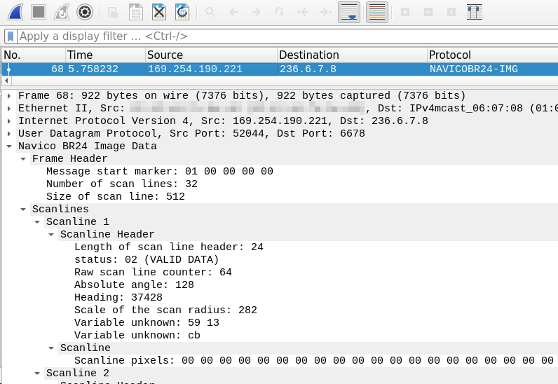

# Wireshark Dissector for Maritime Protocols

This project contains lua plugins for Wireshark with dissectors for maritime network protocols:

- `maritime-dissector` for:
    - IEC 61162-450 (Lightweight Ethernet)
    - NMEA over IP (with sentences defined in NMEA 0183) sent over UDP
    - NMEA2000 over CAN-Bus
- `br24-dissector` for the Navico BR24 RADAR protocol
- `furuno-dissector` for different radars of Furuno
    - Supports encoding/compression level 3 and level 0 (latter not tested yet, due to missing samples)

The `maritime-dissector` plugin was primarily developed by Merlin von Rechenberg while working at Fraunhofer FKIE.

## Screenshot

The IEC 61161-450 dissector in action:<br>


The Navico BR24 dissector:<br>


The Furuno dissector (spoke splitting enabled):<br>

## Dependencies

The plugins are written in lua and use lua5.4 or higher, which is by default shipped with Wireshark.
Wireshark Version 4.0.0 or higher is needed to use this plugin.
It can also be used with TShark instead of Wireshark.
For this lua5.4 (or higher) has to be installed manually because TShark does not include a lua interpreter.

## Quick Start

*Note*: The automated installation script only works for Unix-like systems and installs both plugins.
For other systems please follow the instructions of [Manual installation](#manual-installation)

Download or clone the repository, open a terminal, and navigate into the downloaded directory that includes the `install.sh` file.

Execute the installation script:
```
./install.sh
```
Follow the instructions given by the script.
It might ask for permission to create the private wireshark plugin directory if the directory does not exist yet.
If that is the case press `y` to confirm and continue.

If the script is not executable you can make it executable:
```
chmod +x ./install.sh
```

After the installation the plugin will be loaded automatically by Wireshark.
The dissectors will be used by Wireshark for all packets that match one of the included maritime protocols.

### Manual Installation

Copy all lua files of the plugins you wish to use to the plugin directory of your wireshark installation.
For wireshark standard installations on Unix-like systems this is:
*~/.local/lib/wireshark/plugins*:

```shell
cp ./maritime-dissector.lua ~/.local/lib/wireshark/plugins/
cp -r ./maritime-modules/ ~/.local/lib/wireshark/plugins/

cp ./br24-dissector.lua ~/.local/lib/wireshark/plugins/
cp -r ./br24-modules/ ~/.local/lib/wireshark/plugins/

cp ./furuno-dissector.lua ~/.local/lib/wireshark/plugins/
cp -r ./furuno-modules/ ~/.local/lib/wireshark/plugins/
```

For other systems please use the plugin directories listed in the [official wireshark documentation](https://www.wireshark.org/docs/wsug_html_chunked/ChPluginFolders.html).

To load the plugin, restart Wireshark or reload lua plugins in Wireshark with (usually `ctrl+shift+l`).

## Usage

There are three dissectors included in the maritime dissector plugin, one in the BR24 dissector plugin.

### Maritime Dissector
The first dissector is for plain NMEA sentences as defined in NMEA-0183 contained in UDP packets (NMEA over IP).
The other two dissectors are both for IEC-61162-450 (Lightweight Ethernet) since there are two different types of IEC 61162-450 that are handled as separate protocols by this plugin.

The first of the IEC-61162-450 dissectors is for packets containing NMEA sentences nested inside IEC-61162-450.
The second of the IEC-61162-450 dissectors is for packets containing binary files or binary file fragments.

#### NMEA-0183

The dissector for NMEA sentences that are contained in UDP packets as the payload dissects the following fields:

| Field Name | Field | Description |
| ------ | ------ | ------ |
| TalkerID | nmea-0183.talkerid | Talker ID as defined in NMEA-0183 |
| SentenceID | nmea-0183.sentenceid | Sentence type as defined in NMEA-0183 |
| Data | nmea-0183.data | Comma seperated nautical data contained in the sentence |
| Checksum | nmea-0183.checksum | Checksum of the sentence (Checksum8 XOR) and info if checksum is valid or corrupt |

This dissector shows an expert info if the checksum is corrupt or if the sentence is too long.

#### IEC-61162-450-NMEA

This dissector dissects the following fields of the IEC-61162-450 with header token `UdPbC` containing NMEA sentences:

| Field Name | Field | Description |
| ------ | ------ | ------ |
| Token | iec-61162-450-nmea.token | Identifies message type. For NMEA Messages this should be `UdPbC` |
| Tags | iec-61162-450-nmea.tags | Tag blocks as defined in IEC-61162-450 (`\\`-seperated strings)   |
| Sentence | iec-61162-450-nmea.sentence | NMEA-Sentence containing nautical data as defined in IEC 61162-450 and NMEA 0183 |
| NMEA 0183 | nmea-0183 | Nested dissection of the NMEA sentence using the NMEA 0183 dissector described above |

This dissector shows an expert info if any checksums are corrupt or if the length of any tags exceed the length defined in IEC 61162-450.

#### IEC-61162-450-Binary

This dissector dissects the following fields of the IEC-61162-450 with header token `RrUdP`, `RaUdP` or `RpUdP` containing binary file fragments:

| Field Name | Field | Description |
| ------ | ------ | ------ |
| Token | iec-61162-450-binary.token | Identifies message type and transfer mode. For Binary File Transfer this should be `RaUdP`, `RrUdp` or `RpUdP` |
| Version | iec-61162-450-binary.version | Header version. This dissector is written for version 1 and might not work for higher versions |
| Source ID | iec-61162-450-binary.srcid | ID of the unit that sent the file |
| Destination ID | iec-61162-450-binary.destid | ID of the designated destination unit (can be `XXXXXX` if no specific destination is given) |
| Type | iec-61162-450-binary.mtype | Type of information contained: Can be 1 (data), 2 (query) or 3 (ack) |
| Block ID | iec-61162-450-binary.blockid | Identifies each binary file block that can be fragmented into several datagrams |
| Sequence Number | iec-61162-450-binary.seqnum | Number of the fragment in this datagram. Used for fragmentation and reassembly of the binary file blocks. |
| Maximum Sequence Number | iec-61162-450-binary.maxseqnum | Number of fragments that belong to this binary file block |
| First binary fragment | iec-61162-450-binary.firstpacket | Number of and link to the packet containing the first fragment and the binary file descriptor of the binary file block |
| Previous binary fragment | iec-61162-450-binary.prevpacket | Number and link to the packet containing the previous fragment |
| Next binary fragment | iec-61162-450-binary.nextpacket | Number and link to the packet containing the next fragment |

From the IEC-61162-450-Binary packets, the packet with the first binary file fragment of a whole block also contains a binary file descriptor.
The binary file descriptor has several fields which can be dissected as well.
Two fields of the IEC-61162-450-Binary Header indicate wether a packet has a binary file descriptor or not, the type, and the sequence number.
Those fields must have the following values if a binary file descriptor is present in the packet:
*  Type: `iec-61162-450-binary.mtype==1`
*  Sequence Number: `iec-61162-450-binary.seqnum==1`

If those conditions are fulfilled, the binary file descriptor will always be dissected as a nested protocol of IEC-61162-450-Binary with the following fields:

| Field Name | Field | Description |
| ------ | ------ | ------ |
| File descriptor length | binary-file-descriptor.fd_length | Length of the binary file descriptor |
| File length | binary-file-descriptor.file_length | Length of the whole file (all fragments) |
| Status of acquisition | binary-file-descriptor.stat_of_acquisition | Field for error codes (No error = 0) |
| Device | binary-file-descriptor.device| Data source device as binary value (between 1 and 255) |
| Channel | binary-file-descriptor.channel | Subdivision according to data source (device) (between 1 and 255, default = 1) |
| Type length | binary-file-descriptor.type_length | Length of data type field |
| Data type | binary-file-descriptor.data_type | String describing data type and encoding |
| Status and information text | binary-file-descriptor.stat_and_info | String(s) for additional information, null-terminated each |


#### NMEA-2000

While NMEA-2000 is based on the CAN-Bus, Wireshark still supports the CAN protocol. Our implementation is based on the information provided within the CANBoat [Documentation](https://canboat.github.io/canboat/canboat.html) and [Repository](https://github.com/canboat/canboat). The fields of the NMEA-2000 protocol differ between the different message types by their Parameter Group Number (PGN). Protocol fields that are independent of specific PGNs are listed below:

| Field Name | Field | Description |
| ------ | ------ | ------ |
| Parameter Group Number | nmea-2000.pgn | The PGN identifies the packet type. |
| Source | nmea-2000.src | Source address of the sending device. |
| Destination | nmea-2000.dst | Address of the destination. |
| Priority | nmea-2000.prio | Priority of the message. |
| Data | nmea-2000.data | Raw data contained in the message. |

Note that specific PGN messages may be fragmented across different CAN messages. Our dissector can defragment those messages.

Not all PGNs are currently supported, and some data types (e.g. 8-byte integers) are not supported. Moreover, not all PGNs are described or fully reversed by the CANBoat project. We list the supported or validated PGN in `tests/nmea2000/INFO.md`.

If you want to update the NMEA2000 dissector, you need to execute the `maritime-modules/proto/pgn/pgn.py` and `maritime-modules/knownids/pgn.py` files. These access the current [NMEA2000 definition by Canboat](https://github.com/canboat/canboat/blob/master/docs/canboat.json) and generate the NMEA2000 dissector.

### BR24 Dissector

This plugin dissects UDP messages on port 6678, 6679 and 6680 for BR24 image, report and register messages respectively. Fields should match the description provided in [./docs/BR24-protocol.md](./docs/BR24-protocol.md).

### Furuno Dissector

This plugin dissects UDP messages that have the typical header pattern of Furuno radar network packets. 
Up to now, it only supports the image data packets and does not dissect the TCP connection to control the radar. 
Fields should match the description provided in [./docs/Furuno-protocol.md](./docs/Furuno-protocol.md).

The dissector supports reading azimuth and heading values for data encoded on level 0 (not tested yet, due to missing samples) and level 3.
To reduce memory usage, azimuth and heading values are concatenated into a string separated by spaces (" ").
The single spokes can also be split into individual subtrees that display the corresponding azimuth, heading and encoded data.
It can be enabled via the Wireshark GUI at:<br>
`Edit` -> `Preferences` -> `Protocols` -> `FURUNO-IMG` -> Check `Split Spokes`<br>
Note that this increases the memory usage and is turned off by default.

Other encoding or compression levels are not implemented yet and dissected up to the encoded echo data.

## Tests

Included in this repository are automated tests for the plugin.
The purpose of those tests is to check if the plugin works as intended.
By running the tests you can also get a code coverage report.

### Requirements for the Tests

Additional dependencies are needed for the tests.
The following packages have to be installed on your system:
* `tshark`
* `python3`
* `python3-pytest`
* `lua`
* `luacov` (optional for code coverage report)
* `luacov-console` (optional for code coverage report)

On Debian-based systems you can install `tshark`, `python3`, `python3-pytest`, and `lua` like this:
```
sudo apt-get update
sudo apt-get install tshark python3 python3-pytest lua5.3
```

`luacov` and `luacov-console` can be installed through `luarocks` (https://luarocks.org/).
Those two packages are only needed for the code coverage report.
The tests can be executed without them if you do not need the coverage report.

For running the tests, the dissector should not be installed.
This means the lua files of the dissector *must not* be in the wireshark plugin directory when executing the tests.
If you have already installed the dissector before running the tests, you have to remove all lua files belonging to this dissector from the plugin directory.
For the standard installation on Unix-like systems this can be done by:
```
rm ~/.local/lib/wireshark/plugins/iec-61162-450-nmea.lua
rm ~/.local/lib/wireshark/plugins/iec-61162-450-binary.lua
rm -r ~/.local/lib/wireshark/plugins/iec-61162-450-modules
```
You can reinstall the dissector after running the tests as described in [Quick start](#quick-start).

### Running the Tests

*Important*: The tests can only be executed when the dissector is *not* installed in the plugin directory!
If you have already installed the dissector and want to run the tests, please refer to the previous section [Requirements for the tests](#requirements-for-the-tests).

When all requirements are fulfilled you can run the tests by executing the test script:
```
./tests/test.sh
```

If the script is not executable, you can make it executable:
```
chmod +x ./tests/test.sh
```

## License

The Wireshark plugins are licensed under a [supplemented MIT License](./LICENSE).
