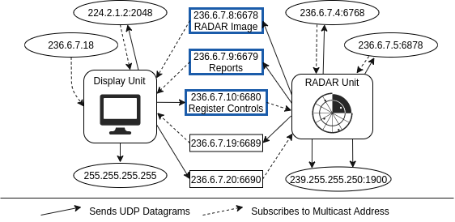
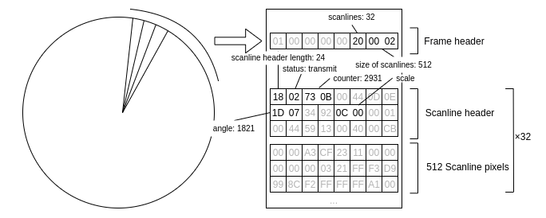

[[_TOC_]]

# Navico BR24

The Navico BR24 protocol is (partially) implemented in the [OpenCPN radarpi plugin](https://github.com/opencpn-radar-pi/radar_pi/tree/master/src/navico), which serves as a source of information for the [Wireshark dissector](README.md).

Further background information on this protocol can be found in [Dabrowski, Adrian, Sebastian Busch, and Roland Stelzer. "A digital interface for imagery and control of a Navico/Lowrance broadband radar." Robotic Sailing. Springer, Berlin, Heidelberg, 2011. 169-181, DOI: 10.1007/978-3-642-22836-0_12](https://link.springer.com/chapter/10.1007/978-3-642-22836-0_12). Their packet captures and implementation of a display unit are available at [Sourceforge](https://sourceforge.net/projects/openbr24/files/OpenBR24-20120302.zip/download) under the name of 'OpenBR24'.

## Communication Structure

Communication between the RADAR unit and the display unit is carried out over UDP multicast with each unit sending and subscribing to a set of addresses. The following figure has been redrawn after Fig.3 in Dabrowski et al.'s paper.

Core functionality is confined to three addresses: `236.6.7.8:6678` for [image data](#image-data), `236.6.7.9:6679` for [reports](#reports), `236.6.7.10:6680` for [register control](#register-control).

Communication packets are made up of fields containing one or more bytes. Fields consisting of two or more bytes should be interpreted as 'little-endian': e.g. the value `0x730B` corresponds to `0x73 | (0x0B << 8) = 2931d`.

## Image Data

Image data is acquired by the RADAR unit through continuous circular scanning of its environment. A full circle is divided into 2048 spokes, as soon as 32 spokes have been generated by the RADAR unit, it builds an image frame that is then sent to `236.6.7.8:6678`. In practice, the average interval between image frames is in the order of 10s of milliseconds.
The following figure has been redrawn after Fig.4 in Dabrowski et al.'s paper.

A BR24 image frame is made up of a eight-byte frame header and 32 scanlines each made up of a 24-byte header and 512 scanline pixels. The total length of an image frame is therefore `8 + 32 * (24 + 512) = 17160` bytes.

### Frame Header

The eight-byte frame header is made up of the following fields:
| byte(s) | length | name | value |
| ----- | ------ | ---- | ----- |
| 0 - 4 | 5      | message start mark | always `0x01 0x00 0x00 0x00 0x00` |
| 5     | 1      | number of scanlines | always `0x20` (`32d`) |
| 6 - 7   | 2      | scanline length | always `0x0002` (`512d`) |

### Scanline Header

Each 24-byte scanline header is made up of the following fields:
| byte(s) | length | name | value |
| ----- | ------ | ---- | ----- |
| 0     | 1      | header length | always `0x18` (`24d`) |
| 1     | 1      | status | enum:   - `0x02`: VALID DATA   - `0x18`: SPINNING UP |
| 2 - 3 | 2      | raw scanline counter | in range `0x0000` - `0xFF0F` (`0d` - `4095d`), incremented by one on each new spoke, modulo 4096. Used by the display unit to check for missing spokes |
| 4 - 7 | 4      | mark | always `0x00 0x44 0x0D 0x0E` |
| 8 - 9 | 2      | angle | angle of the scanline, in range `0x0100` - `0xFF0F` (`1d` - `4095d`), incremented by two on each new spoke, corresponds to the range `0°` - `360°` |
| 10 - 11 | 2    | heading | when coupled with a Navico RI10 or RI11 interface, contains heading of the vessel encoded in the same way as scanline angles(?). Always `0x3492` (`37428d`) in the [OpenBR24 PCAPs](https://sourceforge.net/projects/openbr24/files/OpenBR24-20120302.zip/download) (when disabled?) |
| 12 - 14 | 3*   | scale   | scan range = `value * 10 / sqrt(2)` meters. Differs from the scan range reported in report packets. Length of the field is 2 according to Dabrowski et al., 3 in the radarpi implementation | 
| 15    | 1      | unknown1 | unknown, always `0x01`? |
| 16-17 | 2      | unknown2 | unknown, always `0x0044`? |  
| 18-19 | 2      | unknown3 | unknown, variable |
| 20-23 | 4      | unknown4 | unknown, variable |

### Scanline Pixels

Each 512-byte scanline pixel data row is made up of the following fields:
| bytes(s) | length | name | value |
| -------- | ------ | ---- | ----- |
| 0        | 1      | pixel1 | in range `0x00` - `0xFF` (`0d` - `255d`), 8-bit grayscale color |
| 1        | 1      | pixel2 | ... | 
| ...      | 1      | ... | ... | 
| 511      | 1      | pixel512 | ... |

## Reports

Reports are sent on a regular basis by the RADAR unit to `236.6.7.9:6679` to notify the display unit of its current status and settings, as well as systematically after the reception of a register control packet containing a `READ` or `WRITE` command for a property reported in a given report.

The pattern for sending occasional reports seems to be that the RADAR unit sends `STATUS` reports periodically, to which the display unit responds with a `READ` commands for registers `0x03`, `0x04`, `0x05`, in turn prompting the RADAR unit to respond with `SETTINGS`, `SCAN`, `FIRMWARE` and `BEARING` reports.

Reports are identified by the two first bytes; 
the [OpenCPN radarpi plugin](https://github.com/opencpn-radar-pi/radar_pi/tree/master/src/navico) authors distinguish between `0xC4` reports (second byte is `0xC4`, first byte is either `0x01`, `0x02`, `0x03`, `0x05`, `0x07` or `0x08`), and `0xF5` reports (second byte is `0xF5`, first byte is either `0x08`, `0x0C`, `0x0D`, `0x0F`, `0x10`, `0x11`, `0x12`, `0x13` or `0x14`).

### `0xC4` Reports

#### `0x01C4` Report: STATUS

`0x01C4` reports or STATUS reports are 18-byte packets made up of the following fields:

| bytes(s) | length | name | value |
| -------- | ------ | ---- | ----- |
| 0        | 1      | type | `0x01` |
| 1        | 1      | command | `0xC4` |
| 2        | 1      | RADAR status | enum:   - `0x01`: STANDBY   - `0x02`: TRANSMIT   - `0x05`: WAKING UP |
| 3 - 17   | 15     | unknown | always `0x00` `0x00` `0x00` `0x00` `0x00` `0x00` `0x00` `0x00` `0x00` `0x00` `0x00` `0x00` `0x00` `0x00` `0x00` (?) |

#### `0x02C4` Report: SETTINGS

`0x02C4` reports or SETTINGS reports are 99-byte packets made up of the following fields:

| bytes(s) | length | name | value |
| -------  | ------ | ---- | ----- |
| 0        | 1      | type | `0x02` |
| 1        | 1      | command | `0xC4` |
| 2 - 5    | 4      | range | reported range = `value / 10` meters, might differ from the actual range the RADAR unit is scanning at, which is contained in image frames (see above), used by [OpenCPN](https://opencpn.org) as range displayed in the GUI |
| 6 - 7    | 2      | unknown1 | unknown, always `0x0000` ? |
| 8 - 11   | 4      | gain auto | enum:   - `1d`: AUTO    - `0d`: MANUAL |
| 12       | 1      | gain   | RADAR gain = `value * 100 / 255` | 
| 13       | 1      | sea clutter auto mode | enum:   - `0x00`: OFF   - `0x01`: HARBOR   - `0x02`: OFFSHORE |
| 14 - 16  | 3      | unknown2 | unknown |
| 17       | 1      | sea state | sea state = `value * 100 / 255`, most likely the value of the sea clutter filter|
| 18 - 21  | 4      | unknown3 | unknown |
| 22       | 1      | rain clutter | rain clutter = `value * 100 / 255` |
| 23 - 33  | 11     | unknown4 | unknown |
| 34       | 1      | interference rejection | enum:  - `0x00`: OFF  - `0x01`: LOW  - `0x02`: MEDIUM  - `0x03`: HIGH |
| 35 - 37  | 3      | unknown5 | unknown |
| 38       | 1      | target expansion | unknown |
| 39 - 41  | 3      | unknown6 | unknown |
| 42       | 1      | target boost | enum:  - `0x00`: OFF  - `0x01`: LOW  - `0x02`: HIGH |
| 43 - 98  | 56     | unknown7 | unknown |

#### `0x03C4` Report: FIRMWARE

`0x03C4` reports or FIRMWARE reports are 129-byte packets made up of the following fields:

| bytes(s) | length | name | value |
| -------  | ------ | ---- | ----- |
| 0        | 1      | type | `0x03` |
| 1        | 1      | command | `0xC4` |
| 2        | 1      | radar type | always `0x0F` for BR24 |
| 3 - 57   | 55     | unknown1 | unknown |
| 58 - 89  | 32     | firmware date | 16 2-byte fields representing 16-bit ASCII. E.g. `0x5300` `0x6500` `0x7000` `0x2000` `0x2000` `0x3100` `0x2000` `0x3200` `0x3000` `0x3100` `0x3000` `0x0000` `0x0000` `0x0000` `0x0000` `0x0000` decodes to `Sep  1 2010`) |
| 90 - 121 | 32     | firmware time  | 16 2-byte fields representing 16-bit ASCII. |
| 122 - 128 | 7     | unknown2 | unknown | 

#### `0x04C4` Report: BEARING

`0x04C4` reports or BEARING reports are 66-byte packets made up of the following fields:

| bytes(s) | length | name | value |
| -------  | ------ | ---- | ----- |
| 0        | 1      | type | `0x04` |
| 1        | 1      | command | `0xC4` |
| 2 - 5    | 4      | unknown1 | unknown |
| 6 - 7    | 2      | bearing alignment | alignment angle of the RADAR unit compared to heading times 10 | 
| 8 - 9    | 2      | unknown2 | unknown |
| 10 - 13  | 4      | antenna height | height in millimeters 
| 14 - 65  | 52     | unknown3 | unknown |

#### `0x05C4` Report

Undocumented

#### `0x07C4` Report

Undocumented

#### `0x08C4` Report: SCAN

`0x08C4` reports or SCAN reports are 18-byte packets made up of the following fields:

| byte(s) | length | name | value |
| ------- | ------ | ---- | ----- |
| 0       | 1      | type | `0x08` |
| 1       | 1      | command | `0xC4` |
| 2       | 1      | unknown1 | unknown |
| 3       | 1      | local interference rejection | enum:  - `0x00`: OFF  - `0x01`: LOW  - `0x02`: MEDIUM  - `0x03`: HIGH |
| 4       | 1      | scan speed | enum:  - `0x00`: NORMAL  - `0x01`: FAST |
| 5       | 1      | sls auto | enum:  - `0x00`: MANUAL   - `0x01`: AUTO |
| 6 - 8   | 3      | unknown2 | unknown |
| 9       | 1      | side lobe suppression | sidelobe suppression = `value * 100 / 255` |
| 10 - 11 | 2      | unknown3 | 
| 12      | 1      | noise rejection | unknown |
| 13      | 1      | target separation | unknown |
| 14 - 17 | 4      | unknown4 | unknown |

### `0xF5` Reports

Undocumented

## Register Control

The display unit addresses the RADAR unit via a set of registers, by sending packets to the broadcast address `236.6.7.10:6680`. Registers can be either written to (command `0xC1`) or read from (command `0xC2`), packets have the following structure:

| byte(s) | length | name | value |
| ------- | ------ | ---- | ----- |
| 0       | 1      | register | register number (function to set or read) |
| 1       | 1      | command | enum:   - `0xC1`: WRITE   - `0xC2`: READ | 
| 2 - x   | 0 - x  | data | variable length payload |

The RADAR unit will respond to `READ` commands with a corresponding report packet. 

### Registers

Notable registers are indicated below:

#### Register `0x00`/`0x01`: RADAR Operation

Registers `0x00` and `0x01` control the image data broadcast. When both registers are set to `0x01`, the RADAR unit will send RADAR image data. To stop the stream, both registers must be set to `0x00` according to Dabrowski et al., while OpenCPN's radarpi only sets register `0x01` to `0x00` to do so.

Available PCAPs ([OpenCPN radarpi plugin](https://github.com/opencpn-radar-pi/radar_pi/tree/master/example) and [OpenBR24](https://sourceforge.net/projects/openbr24/files/OpenBR24-20120302.zip/download)) seem to indicate that after both registers are set to `0x01` to start broadcasting, the RADAR unit first sends a large amount of `0xF5` reports.

#### Register `0x03`: Zoom Level

Register `0x03` controls the scan range of the RADAR unit. Writing to this register is done by providing the desired range in decimeters encoded as 32-bit unsigned integer (in little-endian since it is a multi-byte field), e.g. `0x03C1F4010000` to set the range to 50 meters.

Supported range values are the following:
| Range  | Payload      | Range   | Payload      |
| ------ | ------------ | ------- | ------------ |
| 50 m   | `0xF4010000` | 2 km    | `0x204E0000` |
| 75 m   | `0xEE020000` | 3 km    | `0x30750000` |
| 100 m  | `0xEE030000` | 4 km    | `0x409C0000` |
| 250 m  | `0xC4030000` | 6 km    | `0x60EA0000` |
| 500 m  | `0x88130000` | 8 km    | `0x80380100` | 
| 750 m  | `0x4C1D0000` | 12 km   | `0xC0D40100` |
| 1  km  | `0x10270000` | 16 km   | `0x00710200` |
| 1.5 km | `0x983A0000` | 24 km   | `0x80A90300` | 

#### Register `0x05`: Bearing Alignment

Register `0x05` controls the bearing alignment of the RADAR unit. This is used to adjust the alignment of a misaligned RADAR unit. The payload is the desired angle times 10 as 16-bit unsigned integer, e.g. `0x05C11E00` sets the alignment to 30 / 10 = 3 degs.

#### Register `0x06`: Filters and Preprocessing

Register `0x06` allows setting many filters and preprocessing features. The payload is composed of 9 bytes. The first byte is a selector, specifying which feature should be addressed and the remaining 8 bytes are the data that is to be written. Features and the meaning of the bytes 1 - 8 are listed below:

| Feature | Sel. |  1 - 3 |  4  |  5 - 7 |  8   |
| ------- | ---- | ------ | --- | ------ | ---  |
| Gain | `00` | `0x000000` | auto flag:   - `0x00`: MANUAL   - `0x01`: AUTO | `0x000000` | value, when in MANUAL mode, RADAR gain = `value * 100 / 255`  |
| Sea clutter | `02` | `0x000000` | auto flag:   - `0x00`: MANUAL   - `0x01`: AUTO | `0x000000` | value, when in MANUAL mode, RADAR sea clutter = `value * 100 / 255`   when in AUTO mode, possibly the auto type:  - `0x01`: `HARBOR`  - `0x02`: `OFFSHORE`|
| Rain clutter | `04` | `0x000000` | `0x00` | `0x000000` | value, RADAR rain filter = `value * 100 / 255`. Range of `0x01` to `0x50`, defaults to `0x4D` |
| Side lobe suppression | `05` | `0x000000` | auto flag:   - `0x00`: MANUAL   - `0x01`: AUTO | `0x000000` | value, when in MANUAL mode, side lobe suppression = `value * 100 / 255` |

#### Register `0x08`: Interference Rejection

Register `0x08` allows setting the interference rejection mode of the RADAR unit. The payload consist of 1 byte, with following values being accepted: 
- `0x00`: OFF
- `0x01`: LOW
- `0x02`: MEDIUM
- `0x03`: HIGH

#### Register `0x09`: Target Expansion

Not used in BR24

#### Register `0x0A`: Target Boost

Register `0x0A` controls the target boost setting of the RADAR unit. The payload consists of 1 byte, with following values being accepted:

- `0x00`: OFF
- `0x01`: LOW
- `0x02`: HIGH

#### Register `0x0E`: Local Interference Filter

Register `0x0E allows setting the local interference filter mode of the RADAR unit. The payload consist of 1 byte, with following values being accepted: 

- `0x00`: OFF
- `0x01`: LOW
- `0x02`: MEDIUM
- `0x03`: HIGH

#### Register `0x0F`: Scan Speed

Register `0x0F` controls the scan speed of the RADAR unit. The payload consists of 1 byte, with following values being accepted:

- `0x00`: NORMAL
- `0x01`: FAST

#### Register `0x21`: Noise Rejection

Not used in BR24

#### Register `0x22`: Target Separation

Not used in BR24

#### Register `0x23`: Doppler

Not used in BR24

#### Register `0x30`: Antenna Height

Register `0x30` controls the antenna height of the RADAR unit. The payload consists of 8 bytes and takes the following form:

| byte(s) | length | name | value |
| ------- | ------ | ---- | ----- |
| 0 - 3   | 4      | unknown | `0x01000000` |
| 4 - 7   | 4      | height | height in millimeters |

#### Register `0xA0`: Keep Alive

This register must be written to periodically (approx. every 10 seconds) for the RADAR unit to stay on (payload can be empty).
