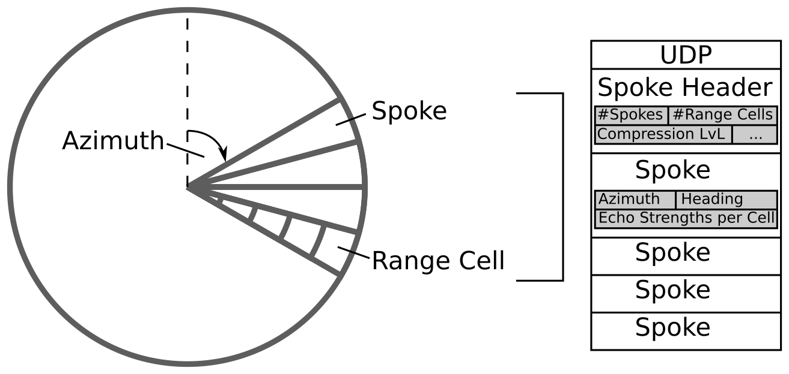
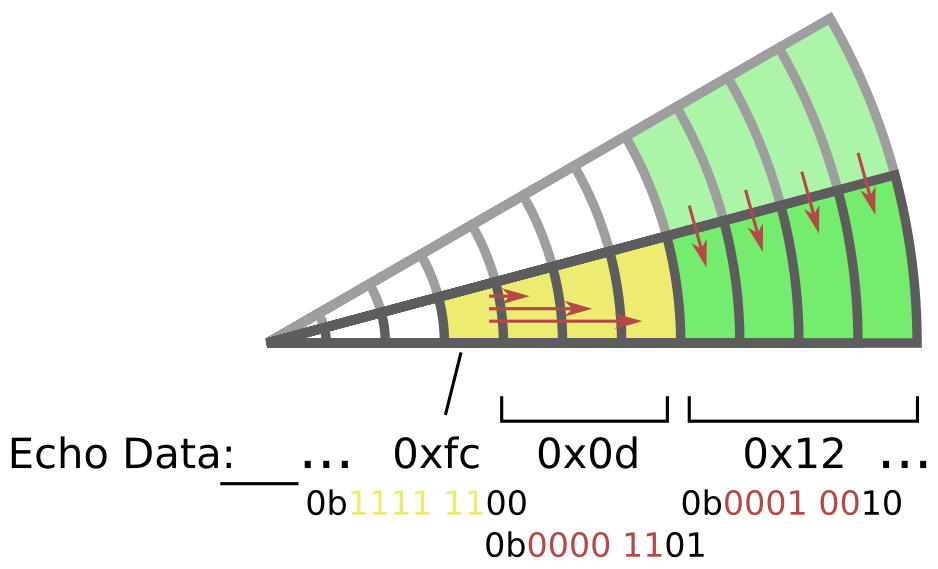

[[_TOC_]]

# Furuno Protocol

The network protocol of Furuno radar systems is a proprietary protocol and has no publicly available documentation.
An implementation of the decoding in Rust can also be found in [MAYARA](https://github.com/keesverruijt/mayara).

## Communication Structure

Radar and display unit communicate using an Ethernet network.
The radar video is shared with participants of an IP multicast group, in which radar unit provides a continuous UDP stream that contains one or multiple radar spokes.
Packets are made up of bit fields, ranging from one bit to multiple bytes. 
Fields consisting of two or more bytes should be interpreted as 'little-endian': e.g. the value `0x730B` corresponds to `0x73 | (0x0B << 8) = 0x0B73 = 2931`.
In addition to that, a Furuno radar typically provides ARPA information in additional broadcasted UDP packets and also keeps a keep a steady TCP connection with the display unit to share and change radar tuning settings, e.g, rain, range or gain.
We want to add these two types of messages to the dissector in the future.

## Image Data

The radar antenna rotates and continuously scans the environment.
Furuno splits a full circle of 360 degrees into a set of 8192 spokes, but only a subset is transmitted by the radar unit to the display.
Each packet to the display contains a variable number of spokes.
The number of spokes in each packet is defined in the header information.
Each spoke is further split into a set of range cells for which the packet states the echo strength that was received by the antenna.
The number of range cells is also defined in the header, together with a range setting value and the encoding/compression level of the spoke.
Note that each compressed spoke is padded to a total length of a multiple of 4 byte.

### Spoke Header

The twelve-byte frame header is made up of the following fields:

| byte(s) | bitmask | length (in bit) | name              | value                                               |
|---------|---------|-----------------|-------------------|-----------------------------------------------------|
| 0       | -       | 8               | Type              | always `0x02`                                       |
| 1       | -       | 8               | Sequence number   | incremented by 1 in each packet                     |
| 2 - 7   | -       | 48              | Furuno Marker     | always `0x00 01 00 00 00 00`                        |
| 8 - 9   | 0x01ff  | 9               | Length            | Length of payload in 4 byte blocks                  |
| 8 - 9   | 0xfe00  | 7               | Spoke count       | Number of spokes in payload                         |
| 10 - 11 | 0x07ff  | 11              | Range Cell count  | Number of Range Cells per spoke                     |
| 10 - 11 | 0x1800  | 2               | Compression Level | Level of compression/encoding used                  |
| 10 - 11 | 0xe000  | 3               | ???               | ???                                                 |
| 12      | -       | 8               | Range             | Value defining range                                |
| 13      | 0x01    | 1               | ACE               | Indicates Automatic Clutter Elimination setting     |
| 13      | 0xfe    | 7               | ???               | ???                                                 |
| 14 - 15 | 0x0fff  | 12              | ???               | ???                                                 |
| 14 - 15 | 0x3000  | 2               | Heading Flag      | Indicates the transmission of heading in each spoke |
| 14 - 15 | 0xc000  | 2               | ???               | ???                                                 |

_Note: The bitmask shall be assigned after reordering the selected byte field into little-endian_

### Spoke Echo Data

Each spoke is made up of the following fields:

| byte(s) | bitmask | length (in bit) | name       | value                                             |
|---------|---------|-----------------|------------|---------------------------------------------------|
| 0 - 1   | -       | 2               | Azimuth    | Range of `0` to `8192`                            |
| 2 - 3   | -       | 2               | Heading    | Encodes heading in some way                       |
| 4 - X   | -       | 4*n             | Image Data | Echo strength encoded according compression level |

The length depends on the efficiency of the compression.

### Echo decoding

Furuno has implemented four levels of compressions to encode the echo strengths in each spoke. 
The used compression in the given packet is stated in the spoke header.

#### 0 - No compression used
No compression is used and thus the Image Data field has the same length as the number of Range Cells.
Each byte states the echo strength in the respective cell.

#### 1 - TBD
#### 2 - TBD

#### 3 - Run-length and Referencing
On level 3, the Image Data is compressed using a combination of run-length encoding (RLE) and a reference to the Range Cell in the previous spoke.
Each byte either contains: 
- the echo strength of the Range Cell
- the number of repetitions of the echo strength of the previous cell in this spoke 
- the number of cells that are equal to the cells in the previous spoke.

The two least-significant bits (`<byte> & 0x03`) indicate how the remaining bits (`<byte> & 0xfc`) have to be interpreted.

| Bit Values  | Encoding  | Remaining bits                                                                                                         |
|-------------|-----------|------------------------------------------------------------------------------------------------------------------------|
| 0bxxxx xx00 | None      | Indicate echo strength of given Range Cell                                                                             |
| 0bxxxx xx01 | RLE       | Indicate the number of following cells, that have the same echo strength as the previous Range Cell                    |
| 0bxxxx xx10 | Reference | Indicate the number of following cells, that have the same echo strength as the respective cells in the previous spoke |
| 0bxxxx xx11 | ???       | _Never seen_                                                                                                           |

The decoding is done until the number of Range Cells was reached that was defined in the spoke header.
The next Spoke Echo Data then starts on the next four-byte block.

## ARPA Data
**TBD**

## Control Data
**TBD**